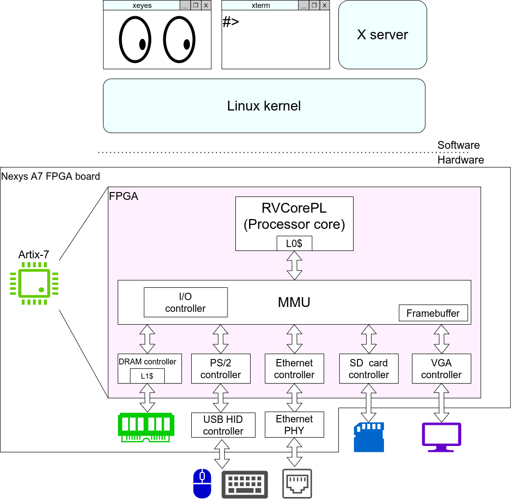

# RV-PC
RV-PC is a GUI-capable RISC-V computer system  on low-end FPGA boards.
It is based on [RVSoC](https://www.arch.cs.titech.ac.jp/wk/rvsoc/doku.php), a portable and Linux capable RISC-V computer system on an FPGA.
Currently, only the Digilent [Nexys4 DDR](https://reference.digilentinc.com/programmable-logic/nexys-4-ddr/start) and the [Nexys A7](https://reference.digilentinc.com/programmable-logic/nexys-a7/start) board is supported.




Demo: https://youtu.be/Kt_iXVAjXcQ

## Specification

* RV32IMA instruction set
* 5-stage pipelined processor core
* Sv32 MMU
* L0 instruction/data caches and  the shared L1 cache
* Linux / X Window System support
* 100Mbps Ethernet / VGA display / microSD card/ USB mouse / PS2 keyboard support

## Getting started

Recommended environment: Ubuntu 18.04 LTS

### 1. Copy the [disk image file(initmem.bin)](https://github.com/kazuki-hr/rv-pc/releases/tag/v0.1.0) to the microSD card.

**Warning: This can potentially cause data loss. Please do this at your own risk.**

```bash
$ dd if=initmem.bin of=/dev/[Device file name of your SD card]
```

### 2.Insert the microSD card into the FPGA board, and connect a USB mouse, VGA display, PS/2 keyboard and (optionally) an Ethernet cable to the FPGA board.

Connect the USB mouse to the built-in USB connector on the board. PS/2 keyboards can be connected to the board by inserting a [Pmod PS2](https://reference.digilentinc.com/pmod/pmodps2/start) into the lower part of the Pmod JB port.
The default resolution of the display is 640x480.


### 3. Create a Vivado project and generate bitstream.
You can create a Vivado project with the following command
```bash
$ vivado -mode batch -source main.tcl
```
or by selecting main.tcl in Tools -> Run Tcl Script in Vivado GUI.

Then open main/main.xpr with Vivado.


You can also use the pre-built [m_main.bit](https://github.com/kazuki-hr/rv-pc/releases/tag/v0.1.0).

### 4. Configure the FPGA.
If you use RV-PC by connecting it to a host PC, you can perform JTAG configuration. If the RV-PC is to be used standalone, you have to perform  Quad-SPI configuration.

## Building the disk image file
The method of building the disk image file is almost the same as [the one for RVSoC](https://www.arch.cs.titech.ac.jp/wk/rvsoc/doku.php?id=binary).
<br>
The only differences are:
* Instead of rvsoc_patch.zip, devicetree_104mhz.zip and initmem_gen.zip, use the corresponding directories in diskimage/ in this repository.
* Change the BBL configure option from --with-arch=rv32imac to --with-arch=rv32ima

You can use diskimage/run.sh.

## License
RV-PC is released under the MIT License, see LICENSE.txt.

## Other projects
[RVSoC](https://www.arch.cs.titech.ac.jp/wk/rvsoc/doku.php),
 a portable and Linux capable RISC-V computer system on an FPGA
 <br>
[RVCore](https://www.arch.cs.titech.ac.jp/wk/rvcore/doku.php),
 an optimized RISC-V soft processor of five-stage pipelining
